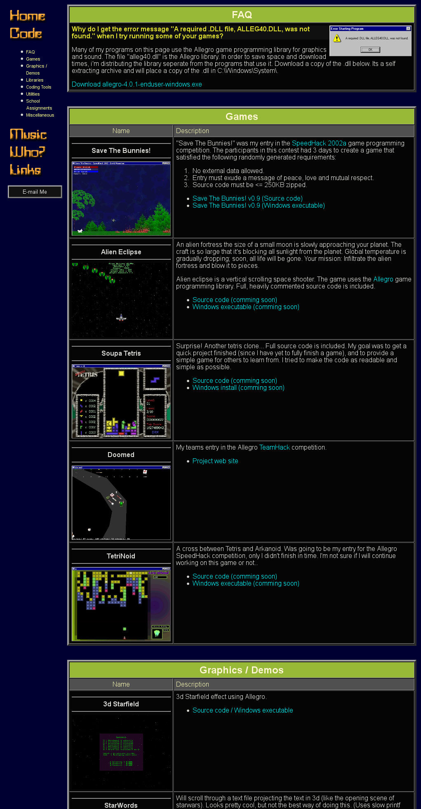
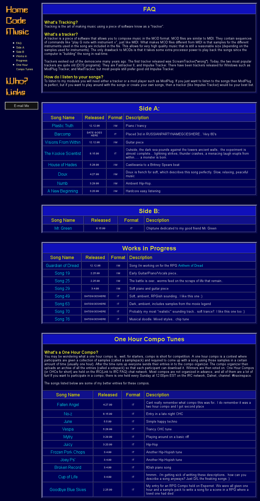

Title: Hello world!
Date: 2014-04-23
Category: rant
Tags: rant
Author: David Maranhao
Summary: Every journey begins with a first step.. 

So I've finally got around to putting up a personal website.. and somehow you've stumbled upon it.  Welcome!  

### Deja-vu 

It's been about 10 years since my previous personal website "Dave's Programming Page" went down with the fall of geocities.  The web was a lot different back then; the word blog had yet to be invented (they were called Homepages) and animated "Under Construction" GIFs were cutting edge.

Here are some screenshots of my old site in 2002:

### Whachutalkinbout?
For the most part this site will be a recreation of the old Dave's programming page with a heavy focus on personal projects.  Any articles / tutorial I write will most likely be on programming / computer related things.  Some non-computer related rants and randomness may make it in there as well.  

### Whyudodat?
Here's what I hope to accomplish through this site:

- Share my creations with the world (software, music, art, ...)
- Document various projects I'm working on to serve as a tutorial to others and notes for myself.
- Exercise my writing ability and hopefully improve.
- Never ending web development.  I can tinker all I like.

